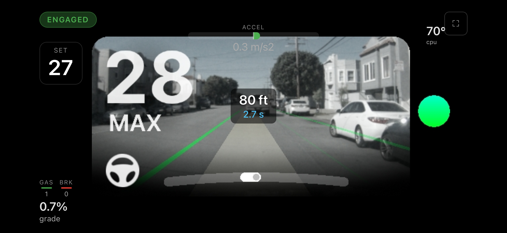

# Comma4-UI-Streamer

Stream your comma 4's live sunnypilot/openpilot UI to any browser on your local network via MJPEG.

  



## What you get

Open `http://<comma-ip>:8082` on your phone, infotainment screen, or any browser — and see the comma UI live with full HUD overlay (lane lines, lead car, speed, alerts).

**Endpoints:**
- `/` — fullscreen viewer page
- `/stream` — raw MJPEG stream
- `/snapshot` — grab a single frame

---

## Requirements

Your phone/browser must be on the **same wifi network** as your comma (or connected via USB tether).

## Setup

sunnypilot already has the stream hook built into `system/ui/lib/application.py` — you just need to drop in the stream server and enable it.

### Step 1 — SSH into your comma

```bash
ssh comma@<your-comma-ip>
```

### Step 2 — Install and enable

```bash
# Download the stream server
curl -sL https://raw.githubusercontent.com/peterclampton/Comma4-UI-Streamer/main/ui_stream.py -o /data/ui_stream.py

# Enable streaming on boot
echo 'export STREAM=1' >> /data/openpilot/launch_env.sh

# Reboot to activate
sudo reboot
```

Then open in your browser:

```
http://<comma-ip>:8082
```

That's it. No patching required — sunnypilot's UI framework automatically imports `/data/ui_stream.py` when `STREAM=1` is set.

---

## Mobile — Add to Home Screen

Works best on phones and tablets when added as a web app. This gives you a fullscreen, app-like experience with no browser bar.

**iOS (Safari):**
1. Open `http://<comma-ip>:8082` in Safari
2. Tap the **Share** button (square with arrow)
3. Scroll down and tap **Add to Home Screen**
4. Tap **Add**

**Android (Chrome):**
1. Open `http://<comma-ip>:8082` in Chrome
2. Tap the **⋮** menu (top right)
3. Tap **Add to Home Screen** (or **Install app**)
4. Tap **Add**

The stream will now open as a standalone app — no browser bar, no tabs, just the live UI.

---

## Configuration

Set these environment variables in `launch_env.sh`:

| Variable | Default | Description |
|----------|---------|-------------|
| `STREAM` | `1` | Enabled by default after install |
| `STREAM_PORT` | `8082` | HTTP port for the stream server |
| `STREAM_QUALITY` | `50` | JPEG quality (1–95) |
| `STREAM_FPS` | `20` | Target frame rate |

Example with all options:

```bash
export STREAM=1
export STREAM_PORT=8082
export STREAM_QUALITY=60
export STREAM_FPS=15
```

---

## How it works

```
sunnypilot UI (raylib) → render texture → RGBA readback → JPEG encode → MJPEG HTTP
```

1. `application.py` checks for `STREAM=1` at startup and imports `ui_stream.py` from `/data/`
2. Each render frame, `capture_frame()` reads the raylib render texture
3. Converts RGBA → RGB JPEG at the configured quality
4. Pushes to connected MJPEG clients via HTTP multipart stream

---

## Compatibility

- **Hardware:** comma 4 (Snapdragon 845)
- **Software:** sunnypilot and openpilot — both use the same `pyray`-based UI framework
- **Browsers:** Safari (iOS), Chrome, Firefox — any browser that supports MJPEG

## Tested on

- comma 4
- sunnypilot staging (March 2026)
- 2017 Lexus RX350 (TSS-P)

## License

MIT
